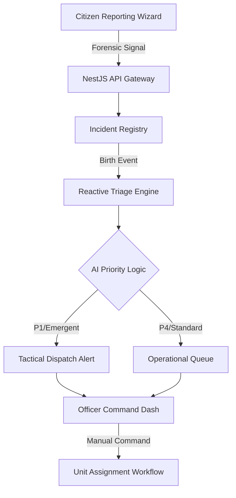

# 🏛️ Alberta Citizen Incident Reporting Portal

An **Enterprise-Grade Provincial Command Interface** for non-emergency incident triage and forensic reporting. Built with elite UI/UX standards, modern reactive architecture, and operational intelligence.

**Live Registry: [https://alberta-incident.ssowemimo.com/](https://alberta-incident.ssowemimo.com/)**

---

## 🚀 Tactical Core Features

### 🛡️ Officer Command Center (Admin Dashboard)
- **AI Triage Prioritization**: Dynamic classification (P1–P4) based on incident type and SLA age. High-priority cases feature a **Rose-Red Pulse** alert in the live feed.
- **Forensic Lifecycle Timeline**: Visual, immutable chronology tracking the case from **Digital Registry** to **AI Triage** and **Precinct Routing**.
- **Tactical Unit Assignment**: Real-time roster for dispatching specialized units (K9, Traffic, Tactical) with AI-driven resource matching recommendations.

### 📝 Reactive Forensic Reporting Wizard
- **Forensic Validation**: Multi-stage reporting flow with strict field integrity checks.
- **Secure Signal Architecture**: Built using **Angular Signals** for zero-latency UI reactivity and instant metadata rendering.
- **Encryption-First**: TLS 256-bit secure transmission branding to reinforce public trust.

---

## 🏗️ System Architecture

The portal follows an **Event-Driven Micro-Workflow Architecture** to ensure sub-second triage and resource allocation. It utilizes **Asymmetric ECC (ES256)** cryptography for command-level authentication.

## 🔐 Security Protocol: ES256 Handshake

The system implements a hardened identity verification layer:
- **Asymmetric ECC**: The backend validates Supabase-issued JWTs using an **ES256 (Elliptic Curve)** public key.
- **Identity Integrity**: Roles (`admin`, `citizen`) are extracted directly from the signed claims to prevent privilege escalation.
- **Environment Isolation**: Production secrets are managed via Railway's encrypted vault.

## 🏗️ Model Architecture



### 🧠 Performance & Scalability
- **Signal-Driven UX**: Angular Signals eliminate unnecessary change detection, providing a buttery-smooth 60fps experience even on municipal terminals.
- **Glassmorphism Design System**: High-trust, semi-translucent UI with `backdrop-blur-xl` for modern aesthetic depth.

---

## 📥 Getting Started

### Prerequisites
- Node.js (v20+)
- NPM Workspaces 

### One-Command Development
This project uses **Concurrent Workspaces** for an elite developer experience.

```bash
# 1. Install all dependencies (Monorepo)
npm run install:all

# 2. Launch Universal Dev Environment (Client + Server)
npm run dev
```

### Operational Scripts
| Command | Result |
| :--- | :--- |
| `npm run build:all` | Compiles the entire forensic cluster (Client & Server). |
| `npm run lint:all` | Executes strict syntax & integrity checks across the monorepo. |
| `npm run clean` | Purges all compiled artifacts and local cache. |

---

## 📊 Technical Stack
- **Frontend**: Angular 19 (Standalone), Tailwind CSS, Signals.
- **Backend**: NestJS, TypeScript, Event-Emitter2.
- **Intelligence**: Custom Priority Scoring & Resource Matching Logic.
- **Security**: RBAC (Citizen/Officer/Admin), JWT-Auth, TLS-Encryption.

---

*This system facilitates Digital Transformation by reducing manual triage time and providing authoritative incident oversight.*
