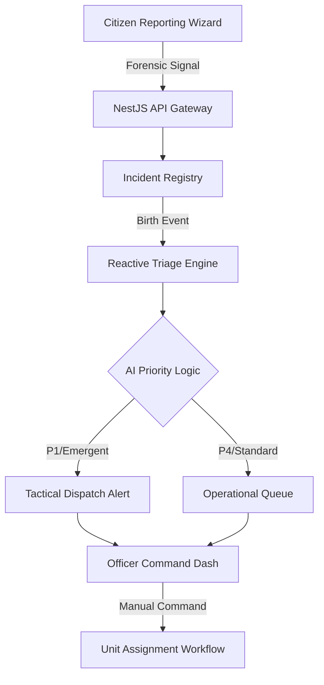

# 🏛️ Alberta Citizen Incident Reporting Portal

An **Enterprise-Grade Provincial Command Interface** for non-emergency incident triage and forensic reporting. Built with elite UI/UX standards, modern reactive architecture, and operational intelligence.

**Live Registry: [https://albertaincident.ssowemimo.com/](https://alberta-incident.ssowemimo.com/)**

---

## 🏗️ Architecture Overview

This project is structured as a high-performance **Monorepo** using NPM Workspaces.

- **[Frontend (client)](file:///client)**: Angular 19 (Standalone), Tailwind CSS 4.0, and Signals-driven state management.
- **[Backend (server)](file:///server)**: NestJS, TypeORM, PostgreSQL, and Supabase Auth integration.

### 🧠 System Workflow

The portal follows an **Event-Driven Micro-Workflow Architecture** to ensure sub-second triage and resource allocation.



---

## 🚀 Getting Started

### Prerequisites
- **Node.js**: v22.0.0+ (Recommended)
- **Database**: PostgreSQL (Supabase or local instance)
- **Auth**: Supabase Project (for JWT verification)

### Installation & Local Setup

1. **Clone & Install Dependencies**:
   ```bash
   git clone https://github.com/femisowems/alberta-incident-report.git
   cd alberta-incident-report
   npm install
   ```

2. **Configure Environment**:
   The backend requires several environment variables. Copy the example file and fill in your credentials.
   ```bash
   cp server/.env.example server/.env
   # Edit server/.env with your DATABASE_URL and SUPABASE_JWT_SECRET
   ```

3. **Launch Development Environment**:
   ```bash
   npm run dev
   ```
   *This command leverages `concurrently` to start both the Angular frontend (localhost:4200) and NestJS backend (localhost:3000) simultaneously.*

---

## 🛠️ Operational Scripts

The root `package.json` provides centralized control over the entire cluster.

| Command | Action |
| :--- | :--- |
| `npm run dev` | Spins up both Client & Server in watch mode. |
| `npm run dev:client` | Launch only the Angular frontend. |
| `npm run dev:server` | Launch only the NestJS backend. |
| `npm run build:all` | Compiles the entire forensic cluster (Client & Server). |
| `npm run lint:all` | Executes strict syntax & integrity checks. |
| `npm run clean` | Purges all compiled artifacts and local cache. |

---

## 📊 Technical Stack

- **Frontend**: Angular 19, Tailwind CSS 4.0, RxJS, Signals.
- **Backend**: NestJS, TypeScript, TypeORM, PostgreSQL.
- **Security**: RBAC (Citizen/Officer/Admin), JWT-Auth (ES256), TLS.
- **Infrastructure**: Railway (Deployment), Supabase (Auth/DB).

---

## 🛡️ Security Protocol: ES256 Handshake

The system implements a hardened identity verification layer:
- **Asymmetric ECC**: The backend validates Supabase-issued JWTs using an **ES256 (Elliptic Curve)** public key.
- **Identity Integrity**: Roles (`admin`, `citizen`) are extracted directly from the signed claims to prevent privilege escalation.

---

*This system facilitates Digital Transformation by reducing manual triage time and providing authoritative incident oversight.*
